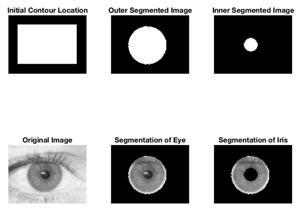

# Iris-FeatureExtraction
## **Introduction** 
The objective of the project is to perform an in-depth analysis of the “Identification using iris Image Analysis in Frequency Domain” presented at the IEEE’s 4th annual International Conference on Knowledge-Based Engineering and Innovation (KBEI) in 2017. The overarching objective of the paper is to provide an efficient methodology to extract features from the iris tissue such as structural and local information of the image. The features extracted from the iris are able to be utilized as a biological identification tool to assist in identification of individuals and assist in fraud detection 

## **Installation** 
Website to download Matlab: https://www.mathworks.com/downloads/ 

## **Experimental Result** 
**Extraction of iris and eyelids from the eye image** 
Feature extraction of an iris can only occur after the boundaries have been identified which can be accomplished through the use of feature separation techniques such as Hough Transform. 

**Internal border separating and calculating the radius and the center of the pupil** 
In order to implement the Hough Transform method, the  “imfindcircles”, “viscircles” and “insertShape” functions in Matlab where used to identify, isolate, and draw the circles in the image to highlight the inner boundary of an iris. The same process was utilized for the outer boundary of the iris. 

**Separating the eyelids and the line between the eyelid and iris** 
The upper and the lower eyelids surrounding the iris are removed to prevent the iris from being blocked and are replace the lost information with the other information obtained from the image.
 

**Segmentation** 
After defining the inner and the outer circles of the iris in the image, a mask is utilized to obtain a logical representation of the outer and inner boundaries of the image. The mask is applied to the inner and outer boundaries independently through the use of  “activecontour” function to obtain the logical representation of the segmented image. 
 

**Normalization and Feature extraction** 
Preprocessing is important because images might not have a suitable contrast for the feature extraction which defeats to purpose of extracting the features from the iris. The elimination of high frequency, bright, pixels in the image is an example of preprocessing to remove any discrepancy which might occur form the position of the light source.
 
 
The gradient of the PST Kernel 

**Reference** 
[1] Hashemi, Seyyed Mohammad. R, et al. “Identification Using Iris Image Analysis in Frequency Domain.” 2017 IEEE 4th International Conference on Knowledge-Based Engineering and Innovation (KBEI), 2017, doi:10.1109/kbei.2017.8324952. 
[2] JalaliLabUCLA. “JalaliLabUCLA/Image-Feature-Detection-Using-Phase-Stretch- Transform.” GitHub, University of California, Los Angeles (UCLA), 2016, github.com/JalaliLabUCLA/Image-feature-detection-using-Phase-Stretch-Transform/tree/master/Matlab. 
[3] Eye with labels [An image originally sourced from the US government EPA "Sunwise" program. It came in PDF format, i converted it into a raster image, then hand traced it section by section. the source image is in the pdf file found]. (n.d.). Retrieved from https://openclipart.org/detail/674/eye-with-labels 

**Aknowledgement** 
@Jose Medina
@Arie Nakhmani

